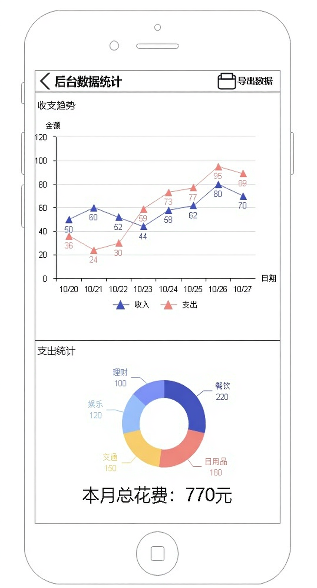

# 实验二：软件设计与建模
231220107 康峻赫
---

## 目录

1. 项目选择与简介
2. 软件的主要功能
3. 模块划分与模块间交互说明
4. UML 图
   * 类图（必画）
   * 用例图（行为性图）
   * 时序图（交互性图）
   * 组件图（结构性图）
5. UI 界面设计
6. 使用大模型/辅助工具的记录与分析
7. 提交文件结构与打包说明

---

## 1 项目选择与简介

**项目名称（示例）：** 个人记账助手

**项目简介：** 该项目是一款面向个人用户的离线优先记账应用，支持用户以微信/QQ号注册、管理账目、分类标签、多条件筛选、统计分析与 Excel 导出等功能。用户可以方便地记录日常收入与支出，查看财务状况，并设定每日消费限额，通过图表分析消费习惯。

**设计目标：**

* 保证基本功能完备，界面清晰、易用；
* 数据本地存储为主（可能扩展到云同步）；
* 模块化设计，便于后续实现与扩展（例如多币种、OCR 自动识别作为 TODO）。
* 使得用户能够方便地管理个人财务，提升理财意识。

---

## 2 软件的主要功能

1. 用户账户管理（注册/登录/注销/找回密码/绑定邮箱手机号）
2. 个性化与界面设置（昵称、头像、主题、本地背景）
3. 记账管理（增/删/改/查、图片、多个标签、条目绑定）
4. 账目查看与筛选（多维度筛选、组合条件）
5. 数据统计与分析（按日/周/月/年统计，饼图/折线图，限额提醒）
6. 数据导出（导出为 .xlsx）

---

## 3 模块划分与模块间交互说明

### 模块划分

* **UI 层（界面）**：负责显示与用户交互。
* **应用层（App Logic）**：处理业务逻辑、输入金额校验、按照所选标签筛选、统计花费计算、限额检测、计算数据图表等。
* **数据访问层（DAL）**：负责数据的持久化读写（目前以csv格式存储为本地文件），导出功能由此层提供。
* **账户服务**：登录、注册、会话管理、个人设置存储。
* **统计与图表引擎**：负责生成统计数据与为 UI 提供绘图数据。
* **导出模块**：将数据转换为 Excel（.xlsx）并保存/分享。

### 模块间交互

* UI 层 -> 应用层：用户操作被封装为时间 Action（如新增条目、筛选、导出），应用层返回数据与状态。
* 应用层 <-> DAL：读取/写入账单、标签、用户配置等用户特殊持有的信息数据。
* 应用层 -> 统计引擎：请求统计数据（按时间段、类别等用户所选分类选项），引擎返回数值与绘图数据。
* 应用层 -> 导出模块：请求导出时，将当前筛选结果传递给导出模块。
* 账户服务与 DAL 共同管理用户相关信息（账户、头像、绑定信息）。

**设计理由：** 分层有利于职责分离、单元测试与未来扩展（如加入云同步、多人账户、协作功能），实现了设计上的解耦。

---

## 4 UML 图

下面为必须的类图以及我选择的三类中另外三种图：用例图（行为性图）、时序图（交互性图）、组件图（结构性图）。
### 4.1 类图

说明：类图覆盖核心实体：User、Account、Entry（账目条目）、Category（类别/标签）、Tag、Budget（限额）、ExportService、Database 等。
其中 User 拥有多个 Entry，Entry 关联 Category 与多个 Tag，Budget 关联 User，用于限额提醒。Database 提供持久化接口，ExportService 负责数据导出功能。Database 类中包含 queryEntries 方法，用于根据多条件筛选账目条目，存储全部的账目数据与每个标签的初始图标与自定义图标路径等信息，为整体系统提供数据支持。


### 4.2 用例图

说明：展示主要的系统参与者（User）与主要用例（注册/登录/记账/统计/导出/设置主题/导出Excel）。显示了软件为用户提供的核心功能操作。


### 4.3 时序图（账目添加的时序图）

说明：展示用户在 UI 上提交新增账目后，UI -> AppLogic -> Database -> UI 的交互流程，并包含统计更新/提醒触发的异步调用（可用消息队列或事件发布机制模拟）。 


### 4.4 组件图

说明：组件图体现系统高层模块（UI、AppLogic、DAL、Export、StatEngine、AuthService）及其依赖。
每个组件功能说明：
* UI 组件：负责用户交互与显示。
* AppLogic 组件：处理业务逻辑与协调各模块。
* StartEngine 组件：负责登录注册与用户会话管理，存储用户设置与提供找回密码等功能。
* ExportService 组件：负责将数据导出为 Excel 文件。
* Database 组件：负责数据的持久化存储与查询，被AppLogic与AuthService调用与依赖。
* AuthService 组件：负责用户认证与授权，依赖 Database 存储用户信息。


---

## 5 UI 界面设计
我使用了亿图图示软件设计我的 UI 界面，以下是主要界面的设计说明与截图。

### 5.1 登录注册界面


说明：用户可以通过微信/QQ号注册或登录，界面简洁，支持找回密码功能。在登录后有设置账号密码功能，后续也可通过邮箱/手机号找回密码，与通过账号密码登录。输入密码时有强度提示，且会隐藏输入内容保证安全。

### 5.2 主界面


说明：主界面在日历中选定所查看的日期，且日期会被红圈标记圈注，显示该日的总收入与支出。下方为账目列表，每种不同支出有独特的图标用以便于辨认，支持按类别图标区分，左侧数字显示即为该笔账目的金额。左上角提供退出软件按钮，右上角的$...$按钮提供了更多操作选项，包括查看统计、导出数据、进入设置等。

### 5.3 数据统计界面


说明：数据统计界面提供了多维度的财务数据分析，用户可以选择不同的时间范围（如日/周/月/年）进行查看。界面中包含饼图与折线图，直观展示各类支出占比与趋势变化。同时，用户可以设置消费限额，并在超出时收到提醒。同时在界面右上角提供了导出按钮，方便用户将统计数据导出为 Excel 文件查看，便于进一步分析与保存记录。

---

## 6 使用大模型/辅助工具的记录与分析

### 使用记录 1

* **使用场景：** 生成初版类图与模块划分建议
* **生成结果：** 模型输出了类列表（User/Entry/Category/Tag/Budget/Database/ExportService）与简单关系图。
* **结果分析：** 大模型可以快速给出完整的实体集合与核心关系，节省了自己从零开始思考并设计出复杂完整类图的时间。
* **缺点/问题：** 初稿中类的方法和属性不够准确（例如没有考虑 images: List<String> 的存储问题），以及没有给出持久化层的实现细节。
* **修改优化：** 我将 images 字段明确为本地路径列表，并补充 Database 接口的方法（queryEntries），并在类图中修改了关系（User 与 Entry 的拥有关系）。
* **最终结果：** 绘制出了更加完整、符合实际需求的类图，且模块划分清晰，并大大节省了设计时间。

### 使用记录 2

* **使用场景：** 绘制初版界面UI草图
* **生成结果：** 模型提供了初步的界面布局建议，包括各个功能模块的位置与交互方式。并使用模型的绘图功能给出了草图示例。
* **结果分析：** 大模型能够快速生成界面草图，帮助我理清各个功能模块之间的关系与布局，节省了手动绘制的时间，并给我提供了新的设计思路与灵感。
* **缺点/问题：** 初版草图中某些交互细节不够明确，例如按钮的具体功能与状态变化，且界面元素的对齐与美观性有待提升。最重要的是即使prompt中详细说明了所需功能，生成的草图仍然遗漏了一些关键功能模块（如限额提醒、数据导出按钮等）。
* **修改优化：** 我在草图中补充了各个按钮的功能说明与状态变化，补全了全部的交互逻辑与功能接口，确保交互逻辑清晰。
* **最终结果：** 绘制出了更加完整、符合实际需求的界面草图，为后续的UI设计提供了良好的基础。


### 总结性思考：大模型如何辅助软件设计

* **能做的事情：** 帮助快速生成草图（类/用例/时序）、提出模块划分建议、列出需求清单、提供交互流程建议。
* **局限性：** 对特定实现细节（例如数据库索引、并发控制、本地文件存储安全）不够精确；自动生成的图通常需要工程师根据实际情况手动微调；对复杂业务逻辑的理解有限，可能遗漏关键功能。
* **实践建议：** 把大模型当作“快速起草与讨论伙伴”，在工程师核验后再固化为设计文档。记录每次使用并说明修改理由，有助于后续复现设计决策，快速产出初版设计文档供团队明确整体方向。

---

## 7 提交文件结构与打包说明
```
实验2_231220107_康峻赫
├── 实验报告.pdf
├── UML
│   ├── UML类图.puml
│   ├── UML类图.png
│   ├── UML用例图.puml
│   ├── UML用例图.png
│   ├── UML时序图_添加账目.puml
│   ├── UML时序图_添加账目.png
│   ├── UML组件图.puml
│   └── UML组件图.png
└── UI界面
    ├── 主界面.png
    ├── 登录注册界面.png
    └── 数据导出界面.png
```