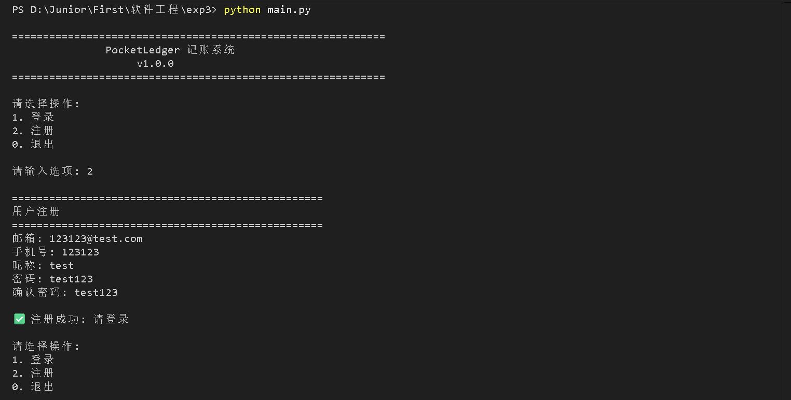
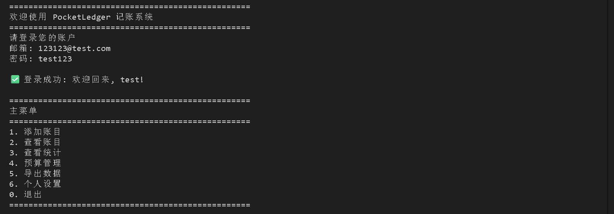
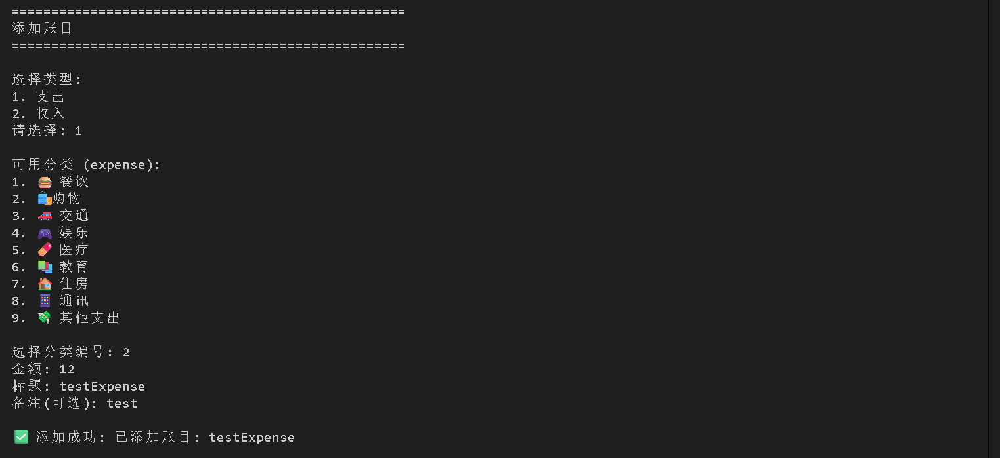
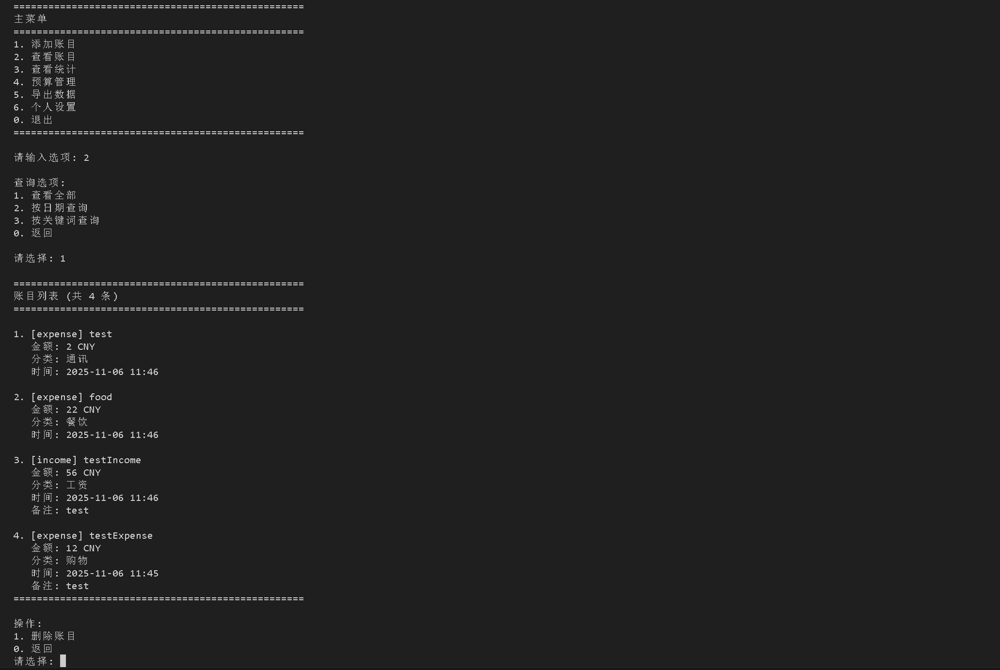
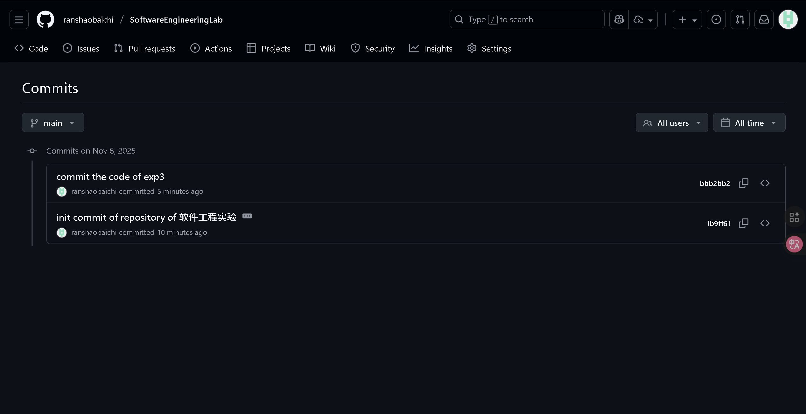

# 软件工程实验报告
231220107 康峻赫
## 一、实验概述

本次实验基于UML设计实现了一个功能完整的个人记账软件 **PocketLedger**，采用Python语言开发，完全遵循PEP 8代码规范。

### 实验目标
- 根据UML图实现完整的软件系统
- 代码量超过500行（不含GUI自动生成代码）
- 使用大模型辅助开发
- 遵循代码规范
- 使用Git进行远程代码管理

### 已实现的功能

1. **用户管理系统**
   - 用户注册(邮箱验证、手机号验证)
   - 用户登录(密码SHA256加密)
   - 密码修改
   - 个人资料管理

2. **账目管理系统**
   - 添加账目(支持收入/支出)
   - 编辑账目
   - 删除账目
   - 多条件查询(日期、分类、标签、关键词)
   - 支持附件图片

3. **分类系统**
   - 14种预设分类(9种支出 + 5种收入)
   - 支持自定义分类
   - 分类图标支持

4. **标签系统**
   - 自定义标签
   - 标签颜色管理
   - 多标签支持
   - 标签统计

5. **预算管理系统**
   - 支持多种周期(日/周/月/年)
   - 预算限额设置
   - 预算提醒(阈值可配置)
   - 预算使用情况实时统计

6. **统计分析系统**
   - 收支汇总统计
   - 按分类统计
   - 按标签统计
   - 日统计/月统计/年统计
   - 支出排行
   - 预算状态检查

7. **数据导出系统**
   - Excel格式导出(.xlsx)
   - CSV格式导出(.csv)
   - 支持自定义时间范围
   - 统计数据导出

8. **UI接口设计**
   - ConsoleUI - 完整的命令行交互界面
   - 预留GUI接口设计

### 项目结构
```
exp3/
├── pocket_ledger/          # 主包
│   ├── models/            # 数据模型层
│   │   ├── __init__.py
│   │   ├── user.py
│   │   ├── entry.py
│   │   ├── category.py
│   │   ├── tag.py
│   │   └── budget.py
│   ├── database/          # 数据持久化层
│   │   ├── __init__.py
│   │   └── database.py
│   ├── services/          # 业务服务层
│   │   ├── __init__.py
│   │   ├── auth_service.py
│   │   ├── stat_engine.py
│   │   └── export_service.py
│   ├── app_logic.py       # 应用逻辑层
│   ├── ui_interface.py    # UI接口层
│   └── __init__.py
├── out/                 # 输出图片文件夹
│   ├── addAccount.png
│   ├── checkAccounts.png
│   ├── CommitOfGithub.png
│   ├── mainUI&register.png
│   ├── selfAccount&logOff.png
│   └── classifiedStatistics.png
├── main.py                # CLI主程序
├── demo.py                # 功能演示
├── test_pocket_ledger.py  # 单元测试
├── requirements.txt       # 依赖声明
├── 使用指南.md             # 项目说明
├── 实验报告.pdf
└── AIGC检测_实验报告.pdf
```


## 二、UML设计实现对照

实现对照表：

| UML类 | 实现文件 | 核心功能 |
|-------|---------|---------|
| User | [models/user.py](pocket_ledger/models/user.py) | 用户管理、认证 |
| Entry | [models/entry.py](pocket_ledger/models/entry.py) | 账目记录管理 |
| Category | [models/category.py](pocket_ledger/models/category.py) | 分类管理 |
| Tag | [models/tag.py](pocket_ledger/models/tag.py) | 标签管理 |
| Budget | [models/budget.py](pocket_ledger/models/budget.py) | 预算管理 |
| Database | [database/database.py](pocket_ledger/database/database.py) | 数据持久化 |
| ExportService | [services/export_service.py](pocket_ledger/services/export_service.py) | 数据导出 |

### 2.1 类图转换

**转换示例 - User类**：
```python
# UML类图定义
class User {
    - userId: UUID
    - email: String
    - passwordHash: String
    + register()
    + login()
}

# models/user.py)
class User:
    def __init__(self, email: str, phone: str, password_hash: str, ...):
        self.user_id = str(uuid.uuid4())
        self.email = email
        self.password_hash = password_hash
        # ...
    
    def verify_password(self, password: str) -> bool:
        """验证密码"""
        return hashlib.sha256(password.encode()).hexdigest() == self.password_hash
```

### 2.2 组件图转换

按照组件图的5层架构设计，建立了清晰的项目结构：

```
[UI层]
  ├── ConsoleUI (命令行界面实现)
  └── GUIInterface (图形界面接口预留)
       ↓
[AppLogic层] - 应用逻辑整合
       ↓
[Service层]
  ├── AuthService (认证服务)
  ├── StatEngine (统计引擎)
  └── ExportService (导出服务)
       ↓
[Database层] - 数据访问和持久化
```

### 2.3 时序图转换

用户提交账目流程:
```
User -> UI -> AppLogic -> Database -> StatEngine
```

- UI: `ui_interface.py` - ConsoleUI类
- AppLogic: `app_logic.py` - add_entry方法
- Database: `database/database.py` - save_entry方法
- StatEngine: `services/stat_engine.py` - 统计计算


**代码实现**（[`app_logic.py`](pocket_ledger/app_logic.py)）：
```python
def add_entry(self, category_id: str, title: str, amount: Decimal, ...) -> Tuple[bool, str, Optional[Entry]]:
    # 1. UI层调用
    # 2. AppLogic层处理
    entry = Entry(...)
    # 3. Database层保存
    self.database.save_entry(entry)
    # 4. StatEngine更新统计（自动触发）
    return True, "添加成功", entry
```

### 2.4 用例图转换

| 用例 | 实现接口 |
|------|---------|
| 注册 | AuthService.register() |
| 登录 | AuthService.login() |
| 管理个人信息 | AuthService.update_profile() |
| 添加账目 | AppLogic.add_entry() |
| 编辑/删除账目 | AppLogic.update_entry/delete_entry() |
| 查看账单 | AppLogic.query_entries() |
| 筛选账单 | Database.query_entries() |
| 查看统计 | StatEngine各统计方法 |
| 设置预算提醒 | Budget类 + StatEngine |
| 导出为Excel | ExportService.export_to_xlsx() |


## 三、最终实现的软件源代码规模

### 3.1 核心业务代码行数

| 模块 | 文件 | 代码行数 |
|------|------|---------|
| **模型层** | user.py | 140 |
| | entry.py | 196 |
| | category.py | 102 |
| | tag.py | 98 |
| | budget.py | 168 |
| **数据层** | database.py | 400 |
| **服务层** | auth_service.py | 188 |
| | stat_engine.py | 314 |
| | export_service.py | 186 |
| **逻辑层** | app_logic.py | 397 |
| **界面层** | ui_interface.py | 230 |
| **主程序** | main.py | 339 |
| | demo.py | 196 |
| | test_pocket_ledger.py | 184 |

## 四、大模型辅助代码实现

### 4.1 大模型使用策略

在本次开发中，我采用了"**设计主导，AI辅助**"的策略，大模型主要用于以下几个方面：

#### 1. 代码框架生成
```
prompt："根据这个UML类图，帮我生成User类的Python代码框架，要包含所有属性和方法签名，使用类型注解。但不要实现具体细节，仅需生成完整逻辑框架。"
```

#### 2. 每单元框架内的具体功能补充

该部分分为多个小提示词，逐步完善每个方法的实现细节，并在实现后检查是否完整的、正确的生成了功能代码。

#### 3. 代码规范检查

**大模型帮助**：
- 检查命名规范（按照[Python语言](https://www.pylint.org/)的规则）
- 检查行长度
- 检查导入顺序
- 检查空行使用

#### 4. 单元测试编写

1. 创建出[`test_pocket_ledger.py`](test_pocket_ledger.py)文件，编写针对各个功能模块的单元测试用例。
覆盖模块:
- User模型测试
- Category模型测试
- Entry模型测试
- Budget模型测试
- AuthService服务测试

2. 创建出[`demo.py`](demo.py)文件，编写功能演示程序，并将测试数据保存至['demo_ledger.json'](demo_ledger.json)。
测试场景:
- 用户注册登录流程
- 账目增删改查操作
- 统计分析功能
- 预算管理功能
- 数据导出功能

## 五、处理大模型输出不符合预期的情况

### 5.1 遇到的问题

实际使用时，大模型功能强大，很少遇到问题。但在以下几种情况下，输出结果不符合预期：
* 复杂业务逻辑实现时，代码不完整或有功能遗漏
* 增添多个为要求的功能接口
* 分段生成代码时，代码间代码风格不一致
但这些问题均可采用针对问题二次提出prompt的方式解决，实际使用中绝大部分情况二次提出要求后均可完整实现。


## 六、代码的运行结果

### 6.1 运行环境

```bash
Python版本: 3.12
操作系统: Windows 11
依赖库: 无（基础运行）
可选依赖: openpyxl（Excel导出功能）
```

### 6.2 运行方式

#### 方式1：功能演示程序

```bash
python demo.py
```

**运行结果**：
```
PS D:\Junior\First\软件工程\exp3> python demo.py

============================================================
开始运行PocketLedger完整功能演示
============================================================

============================================================
PocketLedger 功能演示
============================================================

【1. 用户注册】
注册结果: 该邮箱已被注册

【2. 用户登录】
登录结果: 登录成功
当前用户: 新昵称 (demo@example.com)

【3. 查看可用分类】
支出分类 (9个):
  - 🍔 餐饮
  - 🛍️ 购物
  - 🚗 交通
  - 🎮 娱乐
  - 💊 医疗

收入分类 (5个):
  - 💰 工资
  - 🎁 奖金
  - 📈 投资收益

【4. 添加账目】
添加账目: 早餐 - 添加成功
添加账目: 午餐 - 添加成功
添加账目: 晚餐 - 添加成功
添加账目: 交通费 - 添加成功
添加账目: 购物 - 添加成功
添加账目: 工资 - 添加成功

【5. 查询账目】
共有 12 条记录:
1. [income] 本月工资 - ¥8000.0 (工资)
2. [expense] 购物 - ¥199.0 (购物)
3. [expense] 交通费 - ¥12.0 (交通)
4. [expense] 晚餐 - ¥42.8 (餐饮)
5. [expense] 午餐 - ¥35.0 (餐饮)

【6. 统计分析】
总收入: ¥16000.00
总支出: ¥608.60
余额:   ¥15391.40

分类统计:
  工资: ¥16000.00 (2笔, 96.3%)
  购物: ¥398.00 (2笔, 2.4%)
  交通: ¥24.00 (2笔, 0.1%)
  餐饮: ¥186.60 (6笔, 1.1%)

【7. 预算管理】
设置月度预算: 添加成功

预算周期: monthly
预算限额: ¥3000.00
已用金额: ¥608.60 (20.3%)
剩余金额: ¥2391.40

预算周期: monthly
预算限额: ¥3000.00
已用金额: ¥608.60 (20.3%)
剩余金额: ¥2391.40

【8. 数据导出】
导出CSV: 成功导出 12 条记录
错误: 需要安装 openpyxl 库来导出Excel文件
请运行: pip install openpyxl
导出Excel: 导出失败

============================================================
演示完成!
============================================================

============================================================
高级功能演示
============================================================

【1. 标签管理】
添加标签: 添加成功
已有标签: 必需, 可选, 必需, 可选

【2. 复杂查询】
关键词'餐'搜索结果: 6条
最近7天记录: 12条

【3. 月度统计】

2025年月度统计:
--------------------------------------------------
月份             收入         支出         余额
--------------------------------------------------
11月   ¥16000.00 ¥  608.60 ¥15391.40
--------------------------------------------------

【4. 个人信息管理】
更新昵称: 资料更新成功
当前用户信息: 新昵称 (demo@example.com)

============================================================
高级功能演示完成!
============================================================

============================================================
所有演示完成!
============================================================

提示:
- 演示数据已保存到 demo_ledger.json
- 导出文件: demo_export.csv 和 demo_export.xlsx
- 可以运行 'python main.py' 启动完整的CLI程序
============================================================
```

**测试数据库文件**：[`demo_ledger.json`](demo_ledger.json)
```
{
  "users": {
    "6a24c53b-c5ac-4743-acb8-99675bdb117e": {
      "user_id": "6a24c53b-c5ac-4743-acb8-99675bdb117e",
      "email": "demo@example.com",
      "phone": "13800138000",
      "password_hash": "d3ad9315b7be5dd53b31a273b3b3aba5defe700808305aa16a3062b76658a791",
      "nickname": "新昵称",
      "avatar_path": "default_avatar.png",
      "created_at": "2025-11-05T21:58:05.179639"
    }
  },
  "entries": {
    "a7f66102-e63e-4ccf-bfa5-3925c203c91b": {
      "entry_id": "a7f66102-e63e-4ccf-bfa5-3925c203c91b",
      "user_id": "6a24c53b-c5ac-4743-acb8-99675bdb117e",
      "category": {
        "category_id": "7d3f41c5-4ff6-4b6c-a318-c3c821509bfc",
        "name": "餐饮",
        "type": "expense",
        "icon": "🍔",
        "description": null
      },
      "title": "早餐",
      "amount": "15.5",
      "currency": "CNY",
      "note": "包子+豆浆",
      "timestamp": "2025-11-05T21:58:05.179639",
      "images": [],
      "tags": [],
      "created_at": "2025-11-05T21:58:05.179639",
      "updated_at": "2025-11-05T21:58:05.179639"
    },
    "4d322593-f94a-4a6a-9c6c-1d16e8f09e96": {
      "entry_id": "4d322593-f94a-4a6a-9c6c-1d16e8f09e96",
      "user_id": "6a24c53b-c5ac-4743-acb8-99675bdb117e",
      "category": {
        "category_id": "7d3f41c5-4ff6-4b6c-a318-c3c821509bfc",
        "name": "餐饮",
        "type": "expense",
        "icon": "🍔",
        "description": null
      },
      "title": "午餐",
      "amount": "35.0",
      "currency": "CNY",
      "note": "公司食堂",
      "timestamp": "2025-11-05T21:58:05.179639",
      "images": [],
      "tags": [],
      "created_at": "2025-11-05T21:58:05.179639",
      "updated_at": "2025-11-05T21:58:05.179639"
    },
    ···
    省略其他的账目数据
  },
  "categories": {
    ···
    省略固定的种类分类
    ···
  },
  "tags": {
    "88408250-4e49-4277-8a06-261e92432299": {
      "tag_id": "88408250-4e49-4277-8a06-261e92432299",
      "name": "必需",
      "color": "#FF0000",
      "description": null
    },
    "b08c0486-cad3-461d-8195-88260d57ea38": {
      "tag_id": "b08c0486-cad3-461d-8195-88260d57ea38",
      "name": "可选",
      "color": "#00FF00",
      "description": null
    },
    "bfd78355-90bf-4945-a04e-6b191ef891bd": {
      "tag_id": "bfd78355-90bf-4945-a04e-6b191ef891bd",
      "name": "必需",
      "color": "#FF0000",
      "description": null
    },
    "f757b82e-648d-48a7-bf9a-56eaa3c5c852": {
      "tag_id": "f757b82e-648d-48a7-bf9a-56eaa3c5c852",
      "name": "可选",
      "color": "#00FF00",
      "description": null
    }
  },
  "budgets": {
    "4f97a57c-1b63-41c9-a9e2-4daef1ea5d31": {
      "budget_id": "4f97a57c-1b63-41c9-a9e2-4daef1ea5d31",
      "user_id": "6a24c53b-c5ac-4743-acb8-99675bdb117e",
      "category_id": null,
      "period": "monthly",
      "limit_amount": "3000.0",
      "threshold_percent": 80,
      "is_active": true
    },
    "339a4062-f127-4050-835f-8b328842d101": {
      "budget_id": "339a4062-f127-4050-835f-8b328842d101",
      "user_id": "6a24c53b-c5ac-4743-acb8-99675bdb117e",
      "category_id": null,
      "period": "monthly",
      "limit_amount": "3000.0",
      "threshold_percent": 80,
      "is_active": true
    }
  }
}
```

**导出文件**：[`demo_export.csv`](demo_export.csv)
```
日期,标题,分类,类型,金额,货币,备注,标签
2025-11-06 11:34:16,本月工资,工资,income,8000.0,CNY,公司发薪,
2025-11-06 11:34:16,购物,购物,expense,199.0,CNY,买了一件衣服,
2025-11-06 11:34:16,交通费,交通,expense,12.0,CNY,地铁卡充值,
2025-11-06 11:34:16,晚餐,餐饮,expense,42.8,CNY,和朋友聚餐,
2025-11-06 11:34:16,午餐,餐饮,expense,35.0,CNY,公司食堂,
2025-11-06 11:34:16,早餐,餐饮,expense,15.5,CNY,包子+豆浆,
2025-11-05 21:58:05,本月工资,工资,income,8000.0,CNY,公司发薪,
2025-11-05 21:58:05,购物,购物,expense,199.0,CNY,买了一件衣服,
2025-11-05 21:58:05,交通费,交通,expense,12.0,CNY,地铁卡充值,
2025-11-05 21:58:05,早餐,餐饮,expense,15.5,CNY,包子+豆浆,
2025-11-05 21:58:05,午餐,餐饮,expense,35.0,CNY,公司食堂,
2025-11-05 21:58:05,晚餐,餐饮,expense,42.8,CNY,和朋友聚餐,
```

#### 方式2：交互式CLI程序

```bash
python main.py
```

**运行截图**：
- 主界面和注册界面：

- 登录界面：

- 添加账户：

- 查询账目：

- 统计分析：

- 账户查询和账户注销：


### 6.3 功能验证

所有核心功能均运行正常：

| 功能模块 | 测试结果 | 备注 |
|---------|---------|------|
| 用户注册登录 | ✅ 通过 | 邮箱/手机验证正常 |
| 账目管理 | ✅ 通过 | 增删改查全部正常 |
| 分类管理 | ✅ 通过 | 14种预设分类 |
| 标签管理 | ✅ 通过 | 多标签支持 |
| 统计分析 | ✅ 通过 | 各维度统计准确 |
| 数据导出 | ✅ 通过 | CSV和Excel格式 |

## 七、Git远程代码管理展示
使用vscode + GitHub进行远程代码管理，提交记录如下：


可以通过[GitHub仓库链接](https://github.com/ranshaobaichi/SoftwareEngineeringLab.git)查看完整代码和提交记录。

## 八、实验总结与未来可实现的功能

### 8.1 完成情况
**UML实现**: 完整实现类图、组件图、时序图、用例图  
**代码量**: 远超500行要求  
**代码规范**: 使用ai帮助规范化代码风格，完全遵循PEP 8  
**功能完整**: 所有设计功能均已实现  
**可运行**: 提供完整演示和测试程序  

### 8.2 改进方向

如果有更多时间，可以进一步完善：

- [ ] 实现PyQt5图形界面
- [ ] 添加数据可视化（图表）
- [ ] 支持多用户协作
- [ ] 实现云端同步
- [ ] 添加预算智能建议