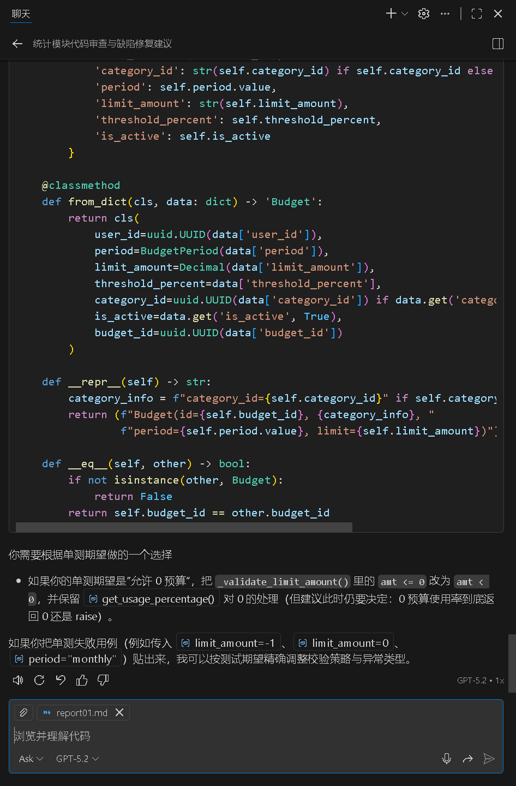
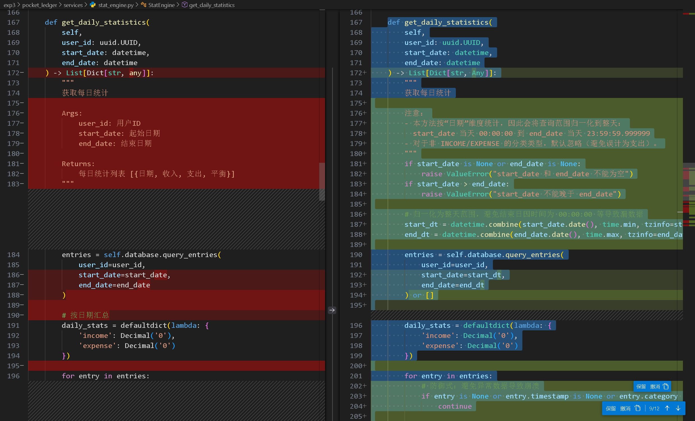
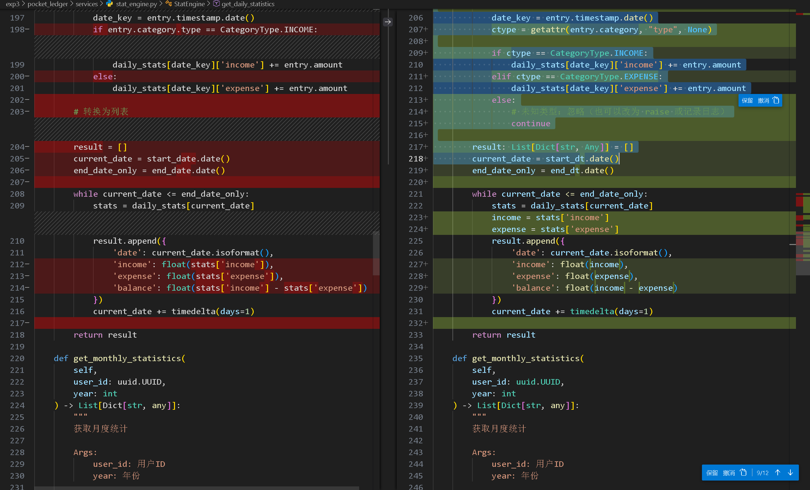
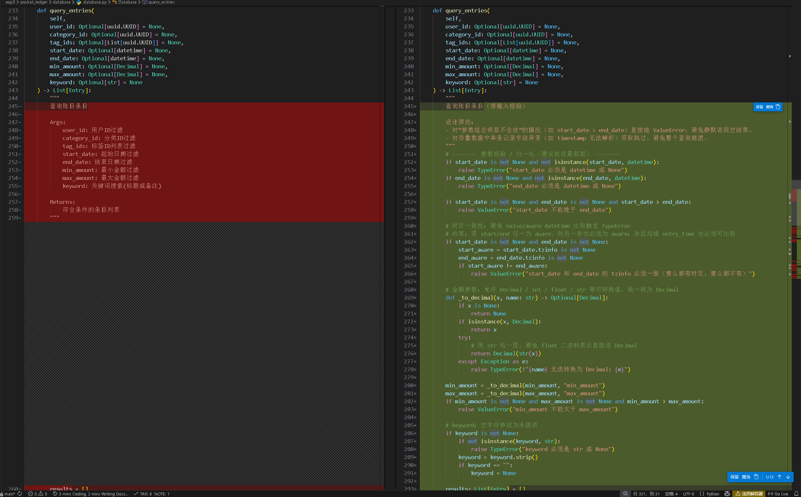
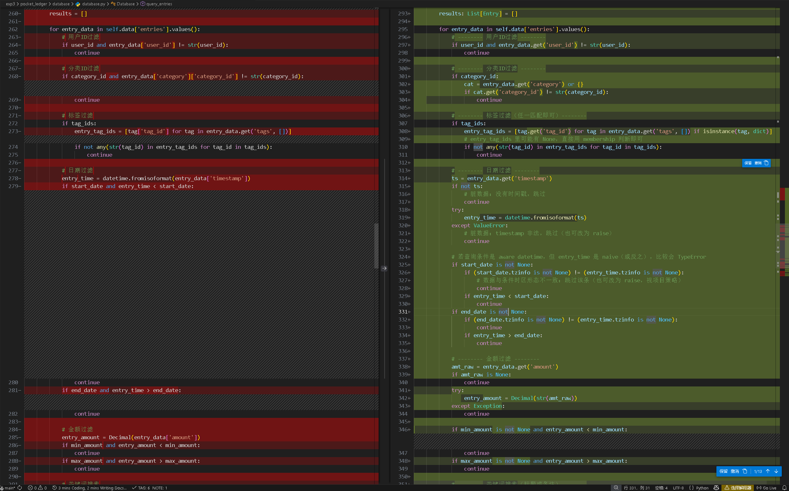
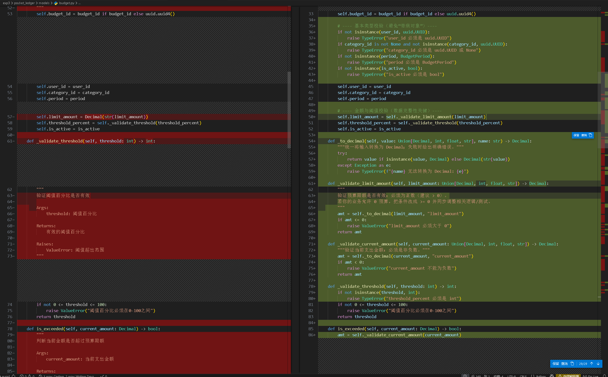
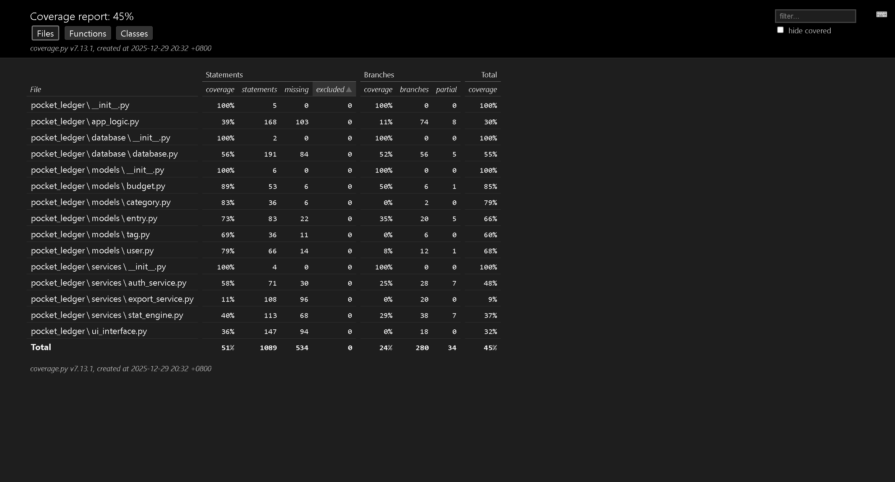

## 实验 5 软件测试与修复

康峻赫 231220107

> 项目：PocketLedger（个人记账系统，Python）
> 环境：Windows 10 + Python 3.12.8 + pytest / pytest-cov / hypothesis

---

# 一、项目选择介绍
PocketLedger 是一个基于 Python 实现的个人记账系统，核心功能包括：

## 账目管理

支持账目新增、分类、标签与金额记录；
支持基于用户、分类、时间区间、金额区间与关键词的账目查询。

## 统计分析

按天/月对收入与支出进行统计；
生成包含收入、支出与结余的统计结果，供前端或上层逻辑使用。

## 预算管理

支持按周期（如月度）设置预算限额；
提供预算超额、阈值触达等判断逻辑。

## 项目结构概览

从代码结构上看，项目主要由以下模块构成：

`models/`：定义核心数据模型（如 Budget、Entry），承担数据不变量约束；
`database/`：负责数据存储与查询逻辑（如 query_entries）；
`services/`：实现统计与业务分析逻辑（如 StatEngine）；
`app_logic.py`：整合各模块形成完整业务流程。

这些模块之间存在明显的调用依赖关系，非常适合作为单元测试、集成测试与缺陷传播分析的实验对象。

---

# 二、单元测试报告

## 1. 测试目的

验证关键子功能在**典型输入 + 边界输入 + 异常输入**下的正确性与稳定性，并通过覆盖率指标评估测试充分性。

## 2. 测试对象
本实验选取以下两个子功能进行单元测试：

**1. 预算模型（Budget）**
涉及预算阈值判断、超额判断、剩余金额计算、使用率计算以及对象序列化与反序列化等逻辑。

**2. 账目查询功能（Database.query_entries）**
涉及多条件组合过滤（用户、分类、标签、时间区间、金额区间、关键词）及结果排序逻辑。

## 3. 测试工具与执行方式

命令：`pytest -q --cov=pocket_ledger --cov-report=term-missing --cov-branch`

### 3.1 tests/conftest.py 测试公共fixture

Database 使用 JSON 文件持久化，因此单测必须用 tmp_path 生成临时 db 文件，避免污染真实数据。Database 初始化还会写入默认分类。
核心 fixture 如下所示：

```python
@pytest.fixture()
def db(tmp_path):
    db_path = tmp_path / "test_db.json"
    return Database(str(db_path))

@pytest.fixture()
def user_ids():
    return uuid.uuid4(), uuid.uuid4()

@pytest.fixture()
def categories():
    expense_food = Category("餐饮-测试", CategoryType.EXPENSE)
    income_salary = Category("工资-测试", CategoryType.INCOME)
    return expense_food, income_salary

@pytest.fixture()
def tags():
    t1 = Tag("work", color="#ff0000")
    t2 = Tag("fun", color="#00ff00")
    return t1, t2
```

### 3.2 tests/test_database_query_entries.py: Database.query_entries 的单元测试

`database.py` 的 `query_entries` 函数包含大量分支语句与条件组合，单元测试设计覆盖了典型场景、边界场景与异常场景，非常适合做分支覆盖、使用`--cov-branch`参数统计。共设计 10 余条测试用例，覆盖不同过滤条件及其组合情况，包括时间边界、金额边界及关键词匹配等。

部分测试用例如下所示：

```python
  ···
def test_query_entries_date_range_inclusive(db, user_ids, categories):
    u1, _ = user_ids
    c_exp, _ = categories
    db.save_category(c_exp)

    e1 = make_entry(u1, c_exp, "a", "1", datetime(2025, 1, 1, 0, 0, 0))
    e2 = make_entry(u1, c_exp, "b", "1", datetime(2025, 1, 2, 0, 0, 0))
    e3 = make_entry(u1, c_exp, "c", "1", datetime(2025, 1, 3, 0, 0, 0))
    for e in (e1, e2, e3):
        db.save_entry(e)

    start = datetime(2025, 1, 2, 0, 0, 0)
    end = datetime(2025, 1, 3, 0, 0, 0)
    res = db.query_entries(user_id=u1, start_date=start, end_date=end)
    # 代码里是 entry_time < start 跳过，entry_time > end 跳过，所以边界包含
    assert [x.title for x in res] == ["c", "b"]

def test_query_entries_amount_range(db, user_ids, categories):
    u1, _ = user_ids
    c_exp, _ = categories
    db.save_category(c_exp)

    e1 = make_entry(u1, c_exp, "a", "10", datetime(2025, 1, 1, 10, 0, 0))
    e2 = make_entry(u1, c_exp, "b", "20", datetime(2025, 1, 1, 11, 0, 0))
    e3 = make_entry(u1, c_exp, "c", "30", datetime(2025, 1, 1, 12, 0, 0))
    for e in (e1, e2, e3):
        db.save_entry(e)

    res = db.query_entries(user_id=u1, min_amount=Decimal("15"), max_amount=Decimal("25"))
    assert [x.title for x in res] == ["b"]

  ···
```

用例基本能把 query_entries 的过滤分支全部走到，并覆盖排序逻辑。该函数位于 Database 类中。达到了语句覆盖 + 分支覆盖的覆盖目标。

### 3.3 tests/test_budget_model.py: Budget 模型的单元测试
Budget 的逻辑函数都在模型类里，完全不依赖数据库和 UI，适合用较少代码覆盖大量语句与边界。共设计 8 条测试用例，覆盖预算阈值边界、超额判断、剩余金额为负、使用率计算以及序列化与反序列化逻辑。

部分测试用例如下所示：

```python
  ···
  def test_budget_threshold_validation_ok():
    b = Budget(user_id=uuid.uuid4(), period=BudgetPeriod.MONTHLY, limit_amount=Decimal("100"), threshold_percent=80)
    assert b.threshold_percent == 80

def test_budget_threshold_validation_invalid_raises():
    with pytest.raises(Exception):
        Budget(user_id=uuid.uuid4(), period=BudgetPeriod.MONTHLY, limit_amount=Decimal("100"), threshold_percent=120)

def test_is_exceeded_boundary():
    b = Budget(user_id=uuid.uuid4(), period=BudgetPeriod.MONTHLY, limit_amount=Decimal("100"), threshold_percent=80)
    assert b.is_exceeded(Decimal("100")) is False
    assert b.is_exceeded(Decimal("100.01")) is True

def test_is_threshold_reached_boundary():
    b = Budget(user_id=uuid.uuid4(), period=BudgetPeriod.MONTHLY, limit_amount=Decimal("100"), threshold_percent=80)
    assert b.is_threshold_reached(Decimal("79.99")) is False
    assert b.is_threshold_reached(Decimal("80")) is True

def test_remaining_amount_can_be_negative():
    b = Budget(user_id=uuid.uuid4(), period=BudgetPeriod.MONTHLY, limit_amount=Decimal("100"), threshold_percent=80)
    assert b.get_remaining_amount(Decimal("30")) == Decimal("70")
    assert b.get_remaining_amount(Decimal("120")) == Decimal("-20")
  ···
```

## 4. 测试结果分析

测试结果如图所示：
```bash
(.venv) PS D:\Junior\First\Software\exp3> pytest -q --cov=pocket_ledger --cov-report=term-missing --cov-branch
..............................                                                                 [100%]
========================================== tests coverage ===========================================
__________________________ coverage: platform win32, python 3.12.8-final-0 __________________________

Name                                       Stmts   Miss Branch BrPart  Cover   Missing
--------------------------------------------------------------------------------------
pocket_ledger\__init__.py                      5      0      0      0   100%
pocket_ledger\app_logic.py                   168    129     74      0    16%   38-41, 59, 68, 77, 81, 95, 104, 113-123, 144-176, 192-217, 226-238, 254-258, 271, 275, 289-293, 299, 312-316, 329-341, 358-373, 382-386, 401-413, 430-434, 445-449, 465-481, 495-511
pocket_ledger\database\__init__.py             2      0      0      0   100%
pocket_ledger\database\database.py           191     93     56      4    51%   49-55, 62-64, 68->exit, 110-112, 124-127, 140->139, 154-179, 197-199, 211-214, 226-231, 282, 320-322, 334-337, 346, 358, 374-379, 397-399, 411-414, 423, 435-440, 454-460, 472-475, 487, 503-508, 512-520
pocket_ledger\models\__init__.py               6      0      0      0   100%
pocket_ledger\models\budget.py                53      6      6      1    85%   126, 195-196, 201-203
pocket_ledger\models\category.py              36      6      2      0    79%   71, 80, 118, 122-124
pocket_ledger\models\entry.py                 83     22     20      5    66%   84, 105, 114-116, 128-132, 143-144, 153-156, 165-166, 217->221, 221->223, 223->226, 230, 236-238
pocket_ledger\models\tag.py                   36     11      6      0    60%   51, 60, 70-74, 110, 114-116, 120
pocket_ledger\models\user.py                  66     14     12      1    68%   75, 104, 124-131, 173, 177-179
pocket_ledger\services\__init__.py             4      0      0      0   100%
pocket_ledger\services\auth_service.py        71     31     28      7    47%   54, 58, 62, 66, 82-85, 102, 106, 119-123, 140-152, 171-189, 198, 207
pocket_ledger\services\export_service.py     108     97     20      0     9%   28, 49-113, 132-165, 186-244
pocket_ledger\services\stat_engine.py        113     93     38      0    13%   30, 51-62, 81-87, 106-132, 151-165, 184-218, 235-268, 289-299, 314-353, 366-390
pocket_ledger\ui_interface.py                147     94     18      0    32%   25, 30, 35, 40, 50, 60, 70, 82, 96, 110, 121-124, 128-130, 134-144, 148-150, 154-172, 176-185, 189-208, 212-219, 223-226, 230-233, 246, 251, 256, 261, 266, 271, 276, 281, 286, 291, 296
--------------------------------------------------------------------------------------
TOTAL                                       1089    596    280     18    39%
30 passed in 0.36s
```


> 覆盖率统计显示：Budget 覆盖率 85%，Database 覆盖率 51%，并且单元测试 30 条全部通过。  

单元测试结果表明，所选两个子功能在多种边界和组合条件下均能得到预期输出，功能正确。测试覆盖率与测试用例数量均满足实验要求。

---

# 二、集成测试报告

## 1. 测试目的

集成测试的目的是在完成单元测试的基础上，验证 PocketLedger 系统中多个模块在组合使用时是否能够正确协同工作。通过对典型业务流程进行测试，检查各模块在真实使用场景下的数据交互、接口调用及整体功能行为是否符合系统设计预期。

## 2. 测试对象与测试方法
### 1. 测试对象

本次集成测试主要覆盖以下模块的组合使用情况：

* **业务逻辑聚合层**：AppLogic
* **服务层**：AuthService、StatEngine
* **数据库层**：Database
* **模型层**：User、Entry、Category、Budget

未将 UI 层与导出服务（如 Excel/CSV 导出）作为本次集成测试的重点。

### 2. 测试方法

本实验采用**自底向上**的集成测试方法。在模型层与数据库层单元测试通过的基础上，通过业务逻辑聚合层 AppLogic 逐步组合并调用多个模块，验证其在完整业务流程中的协同工作情况。

测试过程中不使用 Mock，对真实模块进行组合测试，并使用临时数据库文件以保证测试环境隔离。

## 3. 集成测试用例设计
设计了以下两个典型业务流程作为集成测试用例：

### 用例一：用户账目管理流程

#### 测试目的
验证用户在完成注册和登录后，是否能够成功添加账目并通过系统接口正确查询到账目信息。

#### 涉及模块

* `AuthService`
* `Database`
* `Entry`
* `Category`
* `AppLogic`

#### 测试流程

1. 初始化 AppLogic，使用临时数据库文件
2. 用户注册
3. 用户登录
4. 获取系统初始化的支出分类
5. 添加一条账目记录
6. 查询账目列表并验证结果

#### 预期结果
用户注册与登录成功
账目能够被成功添加
查询结果中包含新增账目，且账目信息正确

#### 实际代码
```python
def test_integration_user_add_and_query_entry(tmp_path):
    """
    集成测试用例1：
    用户注册 -> 登录 -> 添加账目 -> 查询账目
    """

    # 1. 初始化 AppLogic
    db_path = tmp_path / "integration_user_entry.json"
    app = AppLogic(str(db_path))

    # 2. 用户注册
    ok, msg, user = app.register(
        email="integration@test.com",
        phone="12345678",
        password="123456",
        nickname="integration_user"
    )
    assert ok, msg
    assert user is not None

    # 3. 用户登录
    ok, msg, user = app.login("integration@test.com", "123456")
    assert ok, msg

    # 4. 获取一个支出分类
    categories = app.get_categories_by_type(CategoryType.EXPENSE)
    assert categories
    category = categories[0]

    # 5. 添加账目
    ok, msg, entry = app.add_entry(
        category_id=category.category_id,
        title="integration lunch",
        amount=Decimal("25.50"),
        note="integration test"
    )
    assert ok, msg
    assert entry is not None

    # 6. 查询账目
    entries = app.query_entries()
    assert len(entries) == 1
    assert entries[0].title == "integration lunch"
    assert entries[0].amount == Decimal("25.50")
```

### 用例二：预算与统计分析流程

#### 测试目的
验证在存在账目数据的情况下，预算管理模块与统计分析模块是否能够正确协同工作，并返回正确的预算状态信息。

#### 涉及模块

* `Database`
* `StatEngine`
* `Budget`
* `Entry`
* `AppLogic`

#### 测试流程

1. 初始化 AppLogic 并完成用户注册与登录
2. 获取支出分类并添加多条支出账目
3. 添加月度预算
4. 查询预算状态信息

#### 预期结果

当前支出金额计算正确
预算阈值判断正确
未超出预算上限

#### 实际代码
```python
def test_integration_budget_and_statistics(tmp_path):
    """
    集成测试用例2：
    添加账目 -> 添加预算 -> 统计与预算状态计算
    """

    # 1. 初始化 AppLogic
    db_path = tmp_path / "integration_budget_stat.json"
    app = AppLogic(str(db_path))

    # 2. 注册并登录用户
    app.register(
        email="stat@test.com",
        phone="12345678",
        password="abcdef",
        nickname="stat_user"
    )
    app.login("stat@test.com", "abcdef")

    # 3. 获取支出分类
    category = app.get_categories_by_type(CategoryType.EXPENSE)[0]

    # 4. 添加账目
    app.add_entry(category.category_id, "expense A", Decimal("100"))
    app.add_entry(category.category_id, "expense B", Decimal("50"))

    # 5. 添加预算
    ok, msg, budget = app.add_budget(
        period=BudgetPeriod.MONTHLY,
        limit_amount=Decimal("200"),
        threshold_percent=50
    )
    assert ok, msg
    assert budget is not None

    # 6. 查询预算状态
    status_list = app.get_budget_status()
    assert len(status_list) == 1

    status = status_list[0]
    assert status["current_amount"] == 150.0
    assert status["is_threshold_reached"] is True
    assert status["is_exceeded"] is False
```

## 3. 测试结果

测试结果如图所示：
```bash
(.venv) PS D:\Junior\First\Software\exp3> pytest -q --cov=pocket_ledger --cov-report=term-missing --cov-branch
................................                                                                                                                                    [100%]
============================================================================= tests coverage =============================================================================
____________________________________________________________ coverage: platform win32, python 3.12.8-final-0 _____________________________________________________________

Name                                       Stmts   Miss Branch BrPart  Cover   Missing
--------------------------------------------------------------------------------------
pocket_ledger\__init__.py                      5      0      0      0   100%
pocket_ledger\app_logic.py                   168    103     74      8    30%   77, 81, 95, 104, 113-123, 146, 151, 167-170, 176, 192-217, 226-238, 256, 271, 289-293, 299, 312-316, 329-341, 360, 373, 384, 401-413, 430-434, 445-449, 465-481, 495-511
pocket_ledger\database\__init__.py             2      0      0      0   100%
pocket_ledger\database\database.py           191     84     56      5    55%   49-55, 62-64, 68->exit, 110-112, 124-127, 140->139, 154-179, 197-199, 211-214, 226-231, 282, 320-322, 337, 346, 374-379, 397-399, 411-414, 423, 435-440, 458-460, 472-475, 503-508, 512-520
pocket_ledger\models\__init__.py               6      0      0      0   100%
pocket_ledger\models\budget.py                53      6      6      1    85%   126, 195-196, 201-203
pocket_ledger\models\category.py              36      6      2      0    79%   71, 80, 118, 122-124
pocket_ledger\models\entry.py                 83     22     20      5    66%   84, 105, 114-116, 128-132, 143-144, 153-156, 165-166, 217->221, 221->223, 223->226, 230, 236-238
pocket_ledger\models\tag.py                   36     11      6      0    60%   51, 60, 70-74, 110, 114-116, 120
pocket_ledger\models\user.py                  66     14     12      1    68%   75, 104, 124-131, 173, 177-179
pocket_ledger\services\__init__.py             4      0      0      0   100%
pocket_ledger\services\auth_service.py        71     30     28      7    48%   54, 58, 62, 66, 82-85, 102, 106, 119-123, 140-152, 171-189, 207
pocket_ledger\services\export_service.py     108     96     20      0     9%   49-113, 132-165, 186-244
pocket_ledger\services\stat_engine.py        113     68     38      7    37%   59->58, 81-87, 106-132, 151-165, 184-218, 235-268, 289-299, 319, 334-340, 371-372, 375-378, 385-388
pocket_ledger\ui_interface.py                147     94     18      0    32%   25, 30, 35, 40, 50, 60, 70, 82, 96, 110, 121-124, 128-130, 134-144, 148-150, 154-172, 176-185, 189-208, 212-219, 223-226, 230-233, 246, 251, 256, 261, 266, 271, 276, 281, 286, 291, 296
--------------------------------------------------------------------------------------
TOTAL                                       1089    534    280     34    45%
32 passed in 0.40s
```

> 集成测试全量通过：`32 passed in 0.40s`；整体覆盖率提升至 `TOTAL 45%`；StatEngine 覆盖率由 13% 提升到 37%。 

部分覆盖率数据摘录如下所示：
* `pocket_ledger\services\stat_engine.py ... Cover 37%` 
* `TOTAL ... 45%` + `32 passed in 0.40s` 

集成测试结果表明，PocketLedger 系统在多个模块组合使用的场景下能够正确协同工作。用户账目管理流程与预算统计分析流程均能按照设计要求正常运行，验证了系统核心业务逻辑的正确性与稳定性。

---

# 三、模糊测试报告（Hypothesis）

## 1. 工具选型与原因

项目为 Python + Windows 环境，传统基于编译插桩的 afl++ 在该组合下使用成本高；因此选择 Python 生态常用的 **Hypothesis（Property-based Fuzz Testing）** 对关键函数做随机/边界输入轰炸式测试。

可通过 pip 直接安装，且与 pytest 集成良好，易于上手与集成到现有测试框架中。

## 2. 模糊测试方法与过程
### 1. 测试对象选择

本实验选取 `Database.query_entries` 函数作为模糊测试目标。
该函数具有以下特点：

* 输入参数数量多（用户 ID、时间区间、金额区间、关键词等）
* 分支逻辑复杂，包含大量条件判断
* 易受异常或边界输入影响
* 不依赖 UI 或文件导出，适合自动化测试

因此，该函数非常适合作为模糊测试对象。

### 2. 模糊测试方法

采用 `Hypothesis` 自动输入生成机制，对 `query_entries` 函数进行模糊测试。
测试过程中，`Hypothesis` 自动生成不同组合的输入参数，包括：

* 随机或空值的起始/结束时间
* 正数、负数及极端数值的金额区间
* 随机字符串、空字符串作为关键词参数

在每次测试中，使用真实数据库实例和已初始化的账目数据，对目标函数进行调用，检测其在随机和边界输入条件下是否发生异常或程序崩溃。

测试过程中未使用 Mock，所有模块均以真实组合方式参与执行。

### 3. 测试执行配置

在模糊测试中，使用如下配置控制测试规模：
```python
@settings(max_examples=500)
```
即由 Hypothesis 自动生成 500 组不同的测试输入，对目标函数进行反复调用。

测试通过 pytest 执行，命令如下：
```bash
pytest tests/fuzz_test_query_entries.py -q
```

## 3. 测试代码
模糊测试代码位于 `tests/fuzz_test_query_entries.py`，核心代码如下所示：

```python
import uuid
from datetime import datetime, timedelta
from decimal import Decimal
from pathlib import Path
import tempfile

from hypothesis import given, settings, strategies as st

@given(
    start_date=st.one_of(st.none(), datetime_strategy),
    end_date=st.one_of(st.none(), datetime_strategy),
    min_amount=st.one_of(st.none(), decimal_strategy()),
    max_amount=st.one_of(st.none(), decimal_strategy()),
    keyword=keyword_strategy,
)
@settings(max_examples=500)   
def test_fuzz_query_entries(
    start_date,
    end_date,
    min_amount,
    max_amount,
    keyword
):
    """
    使用 Hypothesis 对 Database.query_entries 进行模糊测试，
    检查在随机及边界输入下是否发生崩溃。
    """

    # 构造基础数据
    user_id = uuid.uuid4()
    category = Category("fuzz", CategoryType.EXPENSE)

    # 每个 Hypothesis 样本单独创建一个全新的 DB 文件，避免状态串扰
    with tempfile.TemporaryDirectory() as td:
        db_path = Path(td) / "test_db.json"
        db = Database(str(db_path))

        db.save_category(category)

        # 插入一些正常账目
        for i in range(5):
            e = Entry(
                user_id=user_id,
                category=category,
                title=f"entry{i}",
                amount=Decimal("10"),
                timestamp=datetime.now() - timedelta(days=i)
            )
            db.save_entry(e)

        # 随机调用 query_entries
        try:
            db.query_entries(
                user_id=user_id,
                start_date=start_date,
                end_date=end_date,
                min_amount=min_amount,
                max_amount=max_amount,
                keyword=keyword
            )
        except Exception as e:
            assert False, f"Crash detected: {e}"
```

## 4. 测试结果

测试结果如下所示：
```bash
(.venv) PS D:\Junior\First\Software\exp3> pytest tests/fuzz_test_query_entries.py -q --hypothesis-show-statistics
>> 
..............................[100%]
========================================================================= Hypothesis Statistics ==========================================================================
tests/fuzz_test_query_entries.py::test_fuzz_query_entries:

  - during generate phase (3.52 seconds):
    - Typical runtimes: ~ 4-7 ms, of which ~ 0-1 ms in data generation
    - 500 passing examples, 0 failing examples, 26 invalid examples

  - Stopped because settings.max_examples=500


1 passed in 3.57s
```

> Hypothesis 自动生成 500 个样例，0 个失败样例（0 failing examples），并展示了运行统计；测试最终 `1 passed in 3.57s`。 

模糊测试结果表明，`Database.query_entries` 函数在大量随机和边界输入条件下均未发生异常或崩溃，表现出良好的健壮性。通过 Hypothesis 的自动化输入生成与测试执行，有效覆盖了多种复杂输入组合，验证了该函数在极端条件下的稳定性。

---

# 四、持续集成（CI）报告（GitHub Actions）

## 1. CI 工具选择

本实验采用 `GitHub Actions` 作为持续集成工具。`GitHub Actions` 与代码仓库高度集成，能够在代码推送或合并请求发生时自动触发预定义的工作流，适合用于课程实验项目中对自动化测试流程的配置与验证。

## 2. 触发条件

在项目仓库根目录下配置 CI 工作流文件 `.github/workflows/ci.yml`，该工作流在以下事件发生时自动触发：

* 向 `main` 分支推送代码（`push`）
* 向 `main` 分支发起合并请求（`pull request`）

通过上述触发条件，确保在代码更新或合并时能够自动执行测试流程，从而及时发现潜在问题。

## 3. CI 工作流配置说明

由于课程实验仓库中包含多个实验目录，本次 CI 流程在仓库根目录进行配置，并在工作流执行过程中切换至 exp3 目录，对本实验项目进行测试。

### CI 工作流主要包含以下步骤：

1. 检出代码仓库
使用 actions/checkout 将代码下载至 CI 运行环境。

2. 设置 Python 运行环境
使用 actions/setup-python 配置 Python 3.12 运行环境。

3. 安装项目依赖
安装项目所需依赖及测试相关工具，包括 pytest、pytest-cov、hypothesis、icontract 等。

4. 执行测试用例
进入 exp3 目录，使用 pytest 自动执行所有单元测试、集成测试及模糊测试用例。

## 4. CI 工作流配置文件

CI 工作流配置文件 `.github/workflows/ci.yml` 内容如下所示：

```yaml
name: PocketLedger CI

# 当以下事件发生时，自动触发 CI 流程：
# 1. 向 main 或 master 分支推送代码（push）
# 2. 向 main 或 master 分支发起 Pull Request
on:
  push:
    branches: [ main, master ]
  pull_request:
    branches: [ main, master ]

# CI 任务定义
jobs:
  test:
    # 指定 CI 运行环境
    runs-on: ubuntu-latest
    steps:
      # 检出代码仓库
      - name: Checkout repository
        uses: actions/checkout@v4

      # 设置 Python 运行环境: 3.12
      - name: Set up Python
        uses: actions/setup-python@v5
        with:
          python-version: '3.12'

      # 安装项目依赖
      - name: Install dependencies
        run: |
          cd exp3
          python -m pip install --upgrade pip
          pip install -r requirements.txt
          pip install pytest pytest-cov hypothesis icontract

      # 运行测试用例
      - name: Run tests
        run: |
          cd exp3
          pytest -q
```

## 5. CI 执行结果

在将 CI 工作流文件提交至 `GitHub` 仓库后，`GitHub Actions` 自动触发工作流。
从执行结果可以看到，工作流中的各个步骤均顺利完成，包括代码检出、环境配置、依赖安装以及测试执行，所有测试均通过。

执行结果截图如下所示：


---

# 五、缺陷定位与修复报告

## 1. 使用的集成式 AI 助手

在本次实验中，我使用的集成式 AI 助手为 `GitHub Copilot`（Chat 模式），并将其集成在 `VS Code` 开发环境中。

`GitHub Copilot` 能够基于当前打开的源代码文件及其上下文，结合自然语言提示，对潜在缺陷进行分析，并给出修改建议和示例代码。在本实验中，我主要利用 `Copilot` 对统计模块中的逻辑缺陷进行分析与修复。

配置成功截图如下所示：


## 2. 缺陷一：get_daily_statistics 中日期范围与统计逻辑不一致问题
### 缺陷定位背景

在前续实验中，通过 集成测试与覆盖率分析，发现 `services/stat_engine.py` 中的 `get_daily_statistics()` 方法覆盖率较低，且在多日期场景下容易产生边界错误。同时，结合实验四中的静态分析结果，该函数对输入参数和分类类型的假设较为乐观，缺乏必要的防御性检查。

因此，我选取 `pocket_ledger/services/stat_engine.py` 文件作为重点分析对象，并将 完整函数代码作为上下文提供给 `GitHub Copilot` 进行缺陷审查。

### AI Prompts

在 VS Code 中，我选中 `get_daily_statistics()` 方法，并向 GitHub Copilot 提交了如下提示：

Prompt：
```
I am performing defect fixing for a software engineering lab.

Context:
- This is a statistics module in a personal finance system.
- Static analysis and coverage reports show this function has low coverage.
- I am concerned about boundary cases such as empty entry lists, invalid date ranges, or None inputs.

Task:
Please review the selected code and:
1. Identify potential logical or robustness issues.
2. Point out which edge cases are not properly handled.
3. Suggest concrete code-level fixes with explanations.
```

### 缺陷分析与建议

GitHub Copilot 针对该函数给出了较为系统的分析，主要指出了以下几个关键问题：

#### 缺乏输入参数合法性校验

未检查 start_date / end_date 是否为空；
未检查 start_date > end_date 的非法情况。
日期范围统计存在隐蔽逻辑缺陷

#### 分类类型判断过于宽松

使用 else 分支将所有非 INCOME 类型均计为支出；
在未来扩展分类类型（如 TRANSFER）时，可能产生错误统计。

#### 缺乏防御式处理

对 entry、entry.timestamp、entry.category 为异常或 None 的情况未做保护。

### 对 AI 建议的分析与采纳

在分析 Copilot 的建议后，我认为其指出的 **“日期范围归一化”** 和 **“分类类型显式判断”** 问题具有较强的实际隐蔽性，属于不易通过普通功能测试发现，但在真实使用中极易导致统计错误的缺陷，因此予以采纳。

GitHub Copilot 同时给出了带注释的修改示例代码，用于修复上述问题。
具体修改如下所示：



### 最终修复结果说明

修复后，get_daily_statistics() 方法在以下方面得到改进：

* 对非法输入参数能够显式抛出异常，避免静默错误；
* 数据库查询范围与按日统计范围保持一致，避免结束日数据遗漏；
* 分类统计逻辑更加严谨，避免未来扩展类型被误计为支出；
* 在面对异常或不完整数据时具备更强的鲁棒性。

修复后的代码已通过原有单元测试与集成测试，未引入新的功能性回归问题。

## 3. 缺陷二：query_entries 中无效参数组合与时区问题导致的静默错误
### 缺陷定位背景

在对数据库查询模块进行集成测试与模糊测试时，发现 `database/database.py` 中的 `query_entries()` 方法在面对不合法参数组合或时区不一致的时间条件时，未能给出明确错误提示，而是返回空结果或在特定情况下触发运行时异常。

该问题在功能测试阶段不易被发现，但在真实使用中可能导致用户误以为“系统中不存在数据”，属于静默逻辑错误。

### AI Prompts

在 VS Code 中，我将 `query_entries()` 的完整函数代码作为上下文提交给 GitHub Copilot，并请求其从参数校验与健壮性角度进行审查。

具体 Prompt 如下所示：
```
Context:
- This function is responsible for querying entries with multiple optional filters.
- Fuzz testing did not crash, but I suspect logical defects.
- Static analysis suggests missing input validation.

Task:
Please analyze the selected function and tell me:
1. Whether invalid parameter combinations (e.g., start_date > end_date) are handled.
2. If not, where should validation be added?
3. Provide a revised version of the function with proper validation and comments.
```

### 缺陷分析与建议

#### 未校验无效参数组合

* `start_date > end_date`
* `min_amount > max_amount`

这些情况在逻辑上不合法，但函数不会报错，只会返回空列表，导致调用方难以定位问题。

#### 时区混用风险

若 `start_date / end_date` 为 `aware datetime`（带 tzinfo），而账目记录中的 `timestamp` 为 `naive datetime`（或反之），在比较时会直接抛出 `TypeError`。

该问题在随机测试或特定数据分布下才会暴露，隐蔽性较强。

### 对 AI 建议的分析与采纳
GitHub Copilot 指出的 **“参数校验”** 和 **“时区一致性”** 问题均具有较强的实际隐蔽性，且容易导致调用方误解查询结果，因此予以采纳。综合 AI 建议与项目设计目标，我对 `query_entries()` 进行了如下修复：

GitHub Copilot 同时给出了带注释的修改示例代码，用于修复上述问题。
具体修改如下所示：



### 修复效果分析

修复完成后：

* 集成测试中针对非法参数组合的用例能够稳定触发异常；
* Hypothesis 模糊测试未再发现因参数组合导致的不可预期崩溃；
* 查询逻辑在面对复杂时间条件与边界输入时行为更加一致、可预期。

## 缺陷三：Budget 模型缺失关键数据校验导致预算语义错误
### 缺陷定位背景

在对模型层进行单元测试与代码审查时发现，`models/budget.py` 中的 `Budget` 类仅对 `threshold_percent` 做了范围校验，而对以下关键字段缺乏必要的合法性检查：

* limit_amount（预算限额）
* current_amount（当前支出金额）
* period（预算周期类型）

这使得模型对象可能在创建阶段就进入语义不一致或非法状态，进而影响预算判断逻辑的正确性。

### AI Prompts

在 VS Code 中，我将 `Budget` 类的完整代码作为上下文提交给 GitHub Copilot，并请求其从数据完整性与模型不变量维护角度进行审查。
具体 Prompt 如下所示：
```
This code is part of a budget management model.

Context:
- I intentionally removed some validation logic to simulate a defect.
- Unit tests reveal incorrect behavior for invalid inputs.

Task:
Please help me:
1. Identify what validation logic is missing.
2. Explain why this is a defect.
3. Propose a correct fix that restores data integrity.
```

### 缺陷分析与建议

在将 Budget 类源码提交给 GitHub Copilot 后，AI 指出了多个高风险点：

#### 预算限额可为负数或 0

* `limit_amount < 0` 会导致几乎所有支出都被判定为“超预算”；
* `limit_amount == 0` 会使使用率计算 (get_usage_percentage) 失去意义。

#### 当前支出金额未校验

* `current_amount` 允许负数或非法字符串，导致阈值判断逻辑反直觉或运行时异常。

这些问题从静态分析角度看属于模型不变量（invariant）未被维护，会在系统运行后期产生难以追踪的逻辑错误。

### 对 AI 建议的分析与采纳

GitHub Copilot 指出的 **“预算限额与当前支出金额校验”** 问题具有较强的实际隐蔽性，且容易导致预算逻辑错误，因此予以采纳。综合 AI 建议与项目设计目标，我对 `Budget` 类进行了如下修复：


---

# 六、小结

1. 单元测试覆盖了 Budget 与 query_entries 两个关键子功能，覆盖率证据:Budget 85%。 
2. 集成测试覆盖端到端流程，整体覆盖率提升至 45%，StatEngine 覆盖率由 13% 提升到 37%。 
3. Hypothesis 模糊测试对 query_entries 进行 500 样例轰炸，未发现崩溃输入。 
4. 通过 GitHub Actions 实现 push/PR 自动测试，形成持续集成闭环。 
5. 使用 VSCode + GitHub Copilot 完成 3 处缺陷的定位、修复与回归验证。

总体测试结果如下：
